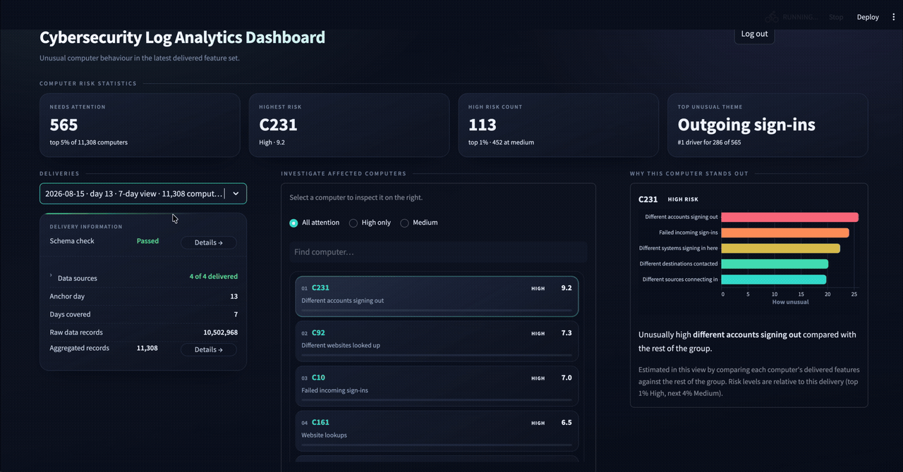

# Cybersecurity Log Analytics Platform

[](https://github.com/peter1706/cybersecurity-log-analytics-platform/actions/workflows/ci.yml)
[](https://github.com/peter1706/cybersecurity-log-analytics-platform/actions/workflows/publish-images.yml)

This repository includes a batch-processing platform which ingests, stores and
processes cybersecurity events in order to be used for a downstream machine
learning application and corresponding dashboard. The system makes use of the
LANL Cyber Security Dataset to simulate the process, which includes
authentication activities, user login, computer accesses, and network-related
events.

The daily pipeline runs end-to-end including the following six stages:
**simulate → bronze → silver → gold → deliver → consume**.

See [PLATFORM_ABSTRACT.md](PLATFORM_ABSTRACT.md) for a one-paragraph summary,
[docs/use_case/USE_CASE_DESCRIPTION.md](docs/use_case/USE_CASE_DESCRIPTION.md) for
the business problem, [docs/dataset/DATASET_DESCRIPTION.md](docs/dataset/DATASET_DESCRIPTION.md)
for the LANL dataset and demonstration subset, and
[docs/requirements/](docs/requirements/) for the system-owner and data-science-team
requirements the platform has been built against.

## Table of contents

- [Showcase of Cybersecurity Log Analytics Platform Dashboard](#showcase-of-cybersecurity-log-analytics-platform-dashboard)
- [Architecture](#architecture)
- [Repository layout](#repository-layout)
- [Running the platform](#running-the-platform)
  - [Quick start](#quick-start)
  - [Service endpoints](#service-endpoints)
  - [Run the pipeline](#run-the-pipeline)
  - [Stop and clean up](#stop-and-clean-up)
- [Configuration](#configuration)
- [Development and testing](#development-and-testing)
  - [Data volume processed by the e2e tests](#data-volume-processed-by-the-e2e-tests)
- [Published images](#published-images)
- [Dataset and citation](#dataset-and-citation)

## Showcase of Cybersecurity Log Analytics Platform Dashboard



## Architecture


**Tech stack:** Apache Airflow (orchestration), Apache Spark + Delta Lake
(Medallion bronze/silver/gold), MinIO (object storage), PostgreSQL (Airflow
metadata + governance catalog), Streamlit (ML-mock dashboard), Docker Compose.

## Repository layout

```text
airflow/                 Airflow DAGs and config
catalog/                 Governance catalog (schema, lineage, manifests)
data/subset/             Pre-filtered LANL demonstration subset
docs/                    Use case, dataset, requirements, architecture
scripts/                 Secrets init, pipeline, and backfill helpers
services/
  lanl-simulator/        Replays daily LANL batches into landing
  spark-processor/       Bronze → Silver → Gold processing
  delivery/              Encrypts Gold and writes delivered output
  ml-mock/               Mock consumer + Streamlit dashboard
tests/                   Unit and e2e tests
```

## Running the platform

**Prerequisites**: Docker + Docker Compose, Python 3, and `make`. The full 14-day
volume run below is comfortable on ≥8 GB RAM / ≥4 cores (`SPARK_DRIVER_MEMORY`
and other hardware settings in `.env.example` can be lowered for smaller machines if required).

### Quick start

```bash
cp .env.example .env       # non-sensitive config; edit if needed
make secrets                # generate ./secrets (override defaults in scripts/init_secrets.sh if desired)
make build                  # build airflow, simulator, spark-processor, delivery, ml-mock Docker images
make up                     # start MinIO, Postgres (catalog + Airflow), Airflow Docker services
```

`.env` and `./secrets` are gitignored — never commit them with your own credentials!

### Service endpoints

Once the complete stack is set up and healthy you can access:

| Service | URL | Credentials |
|---------|-----|-------------|
| Airflow UI | http://localhost:8080 | `AIRFLOW_ADMIN_USER` in `.env` / `airflow_admin_password` in `./secrets` |
| MinIO console | http://localhost:9001 | `minio_root_user` and `minio_root_password` in `./secrets` |
| ML-mock consumer dashboard | http://localhost:8501 | `ml_dashboard_username` and `ml_dashboard_password` in `./secrets` |

### Run the pipeline

Seed a 7-day or up to full 14-day backfill to simulate the fill-in and daily
executed pipeline. Below runs the `daily_pipeline` DAG for a single day
end-to-end (simulate → bronze → silver → gold → deliver → consume) for every day
for the default rolling window of 7 days (the default rolling window for
processing can be changed by setting `ROLLING_WINDOW_DAYS` in the `.env` file):

```bash
make backfill START=0 END=6         # smaller 7-day subset - start anchor day 0 and end anchor day 6
make backfill START=0 END=13        # complete 14-day subset - start anchor day 0 and end anchor day 13
```

**To confirm the platform holds up at realistic volume of multiple million data
records**, run the full 14-day backfill. It processes the entire ~19.8M-row /
14-day subset (seeding the full 7-day rolling window for every one of the 14
anchor days), delivers + consumes each day, and asserts the multi-day
Gold/delivered output in MinIO — end to end in about **~12 minutes** (image build
included) on a 12-core / 36 GB RAM machine.

### Stop and clean up

```bash
make down    # stop the stack (volumes are kept)
make clean   # remove local caches and generated data layers (bronze/silver/gold/…)
```

## Configuration

Non-sensitive settings live in `.env` (copy from `.env.example`). Credentials are
file-based Docker secrets under `./secrets`, created by `make secrets`
(`scripts/init_secrets.sh`).

Key variables:

| Variable | Role |
|----------|------|
| `ROLLING_WINDOW_DAYS` | Silver → Gold window length (default `7`) |
| `SPARK_DRIVER_MEMORY` | Spark driver heap (default `3g`; lower on small machines) |
| `AIRFLOW_ADMIN_USER` | Airflow UI username (password is the `airflow_admin_password` secret) |
| `IMG_*` | Image tags for airflow / simulator / spark / delivery / ml-mock (local `:dev` by default) |

See `.env.example` for the full list, including MinIO buckets, Spark shuffle
tuning, and how to point `IMG_*` at published GHCR tags.

## Development and testing

```bash
make install     # one-time: install dev/test tooling
make lint        # ruff lint checks
make fmt         # auto-format with ruff
make test-unit   # fast pytest suite, no Docker required
make e2e         # runs `make pipeline` then verifies Gold/delivered output in MinIO
make e2e-full    # backfills days START..END (default 0..6), then verifies multi-day Gold output
make e2e-full-14 # backfills the full 14-day demonstration subset (days 0..13)
```

`make e2e` and `make e2e-full` build the images and bring up the full Docker Compose
stack themselves, so a plain `make test-unit` is enough for quick iteration.

### Data volume processed by the e2e tests

The e2e tests run against the pre-filtered LANL subset checked into `data/subset/`
(auth, proc, flows, dns, redteam), which covers 14 simulated days over 250
background hosts plus the redteam-compromised hosts, ~19.8M rows / ~101 MB gzipped
in total:

- `make e2e` (single day, day 0): ~1.5M rows across all sources (~7 MB gzipped).
- `make e2e-full` (7-day backfill, days 0-6): ~9.3M rows across all sources
  (~45 MB gzipped), which seeds a full rolling window for the Silver → Gold step.
- `make e2e-full-14` (full 14-day backfill, days 0-13): the entire ~19.8M-row
  demonstration subset (~101 MB gzipped).

## Published images

`.github/workflows/publish-images.yml` builds every custom image (airflow,
lanl-simulator, spark-processor, delivery, ml-mock) from the same Dockerfiles
used locally and publishes them to GitHub Container Registry (GHCR) on every push to `main` (tag
`sha-<short-git-sha>`) and on release tags (tag `vX.Y[.Z][-pre]`). `make build`
never needs registry access — see `.env.example` for how to point the `IMG_*`
variables at a published tag instead of building locally.

## Dataset and citation

The platform is demonstrated on a subset of the
[LANL Comprehensive, Multi-Source Cyber-Security Events](https://csr.lanl.gov/data/cyber1/)
dataset. Details of the full dataset and the checked-in demonstration subset are
in [docs/dataset/DATASET_DESCRIPTION.md](docs/dataset/DATASET_DESCRIPTION.md).

> A. D. Kent, “Comprehensive, Multi-Source Cyber-Security Events,”
> Los Alamos National Laboratory, http://dx.doi.org/10.17021/1179829, 2015.
