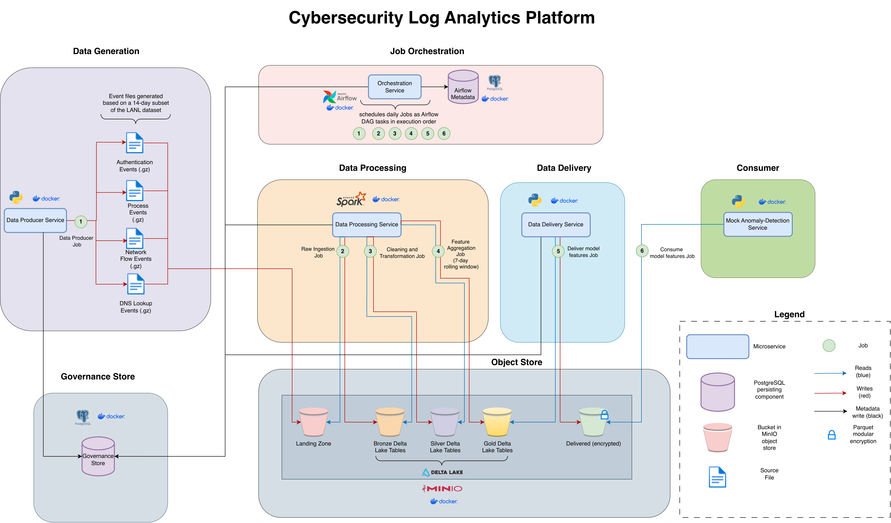

# Cybersecurity Log Analytics Platform
This repository includes a batch-processing platform which should ingest, store and process cybersecurity events in order to be used for a downstream machine learning application. The system makes uses of the LANL Cyber Security Dataset, which includes authentication activities, user login, computer accesses, and network-related events.

## Architecture



## Running the platform

Prerequisites: Docker + Docker Compose, Python 3, and `make`.

```bash
cp .env.example .env       # non-sensitive config; edit if needed
make secrets                # generate ./secrets
make build                  # build airflow, simulator, spark-processor, delivery, ml-mock Docker images
make up                     # start MinIO, Postgres (catalog + Airflow), Airflow Docker services
```

Once the stack is healthy:

- Airflow UI — http://localhost:8080 (user/password from `AIRFLOW_ADMIN_USER` / the `airflow_admin_password` secret)
- MinIO console — http://localhost:9001
- ML-mock consumer dashboard — http://localhost:8501

Run the `daily_pipeline` DAG for a single day end-to-end (simulate → bronze → silver → gold → deliver → consume):

```bash
make pipeline                       # day 0
make backfill START=0 END=6         # seed a full rolling window across several days
```

Stop the stack (volumes are kept) with `make down`.

## Testing

```bash
make install     # one-time: install dev/test tooling
make test-unit   # fast pytest suite, no Docker required
make e2e         # runs `make pipeline` then verifies Gold/delivered output in MinIO
make e2e-full    # backfills days START..END (default 0..6), then verifies multi-day Gold output
make e2e-full-14 # backfills the full 14-day demonstration subset (days 0..13)
```

`make e2e` and `make e2e-full` build the images and bring up the full Docker Compose
stack themselves, so a plain `make test-unit` is enough for quick iteration.

### Data volume processed by the e2e tests

The e2e tests run against the pre-filtered LANL subset checked into `data/subset/`
(auth, proc, flows, dns, redteam), which covers 14 simulated days over 250
background hosts plus the redteam-compromised hosts, ~19.8M rows / ~101 MB gzipped
in total:

- `make e2e` (single day, day 0): ~1.5M rows across all sources (~7 MB gzipped).
- `make e2e-full` (7-day backfill, days 0-6): ~9.3M rows across all sources
  (~45 MB gzipped), which seeds a full rolling window for the Silver → Gold step.
- `make e2e-full-14` (full 14-day backfill, days 0-13): the entire ~19.8M-row
  demonstration subset (~101 MB gzipped). A manual/local reproducibility check,
  not run in CI — the `e2e` job (day 0) is CI's e2e gate, on every PR into `main`.

## Published images

`.github/workflows/publish-images.yml` builds every custom image (airflow,
lanl-simulator, spark-processor, delivery, ml-mock) from the same Dockerfiles
used locally and publishes them to GHCR on every push to `main` (tag
`sha-<short-git-sha>`) and on release tags (tag `vX.Y[.Z][-pre]`). `make build`
never needs registry access — see `.env.example` for how to point the `IMG_*`
variables at a published tag instead of building locally.
